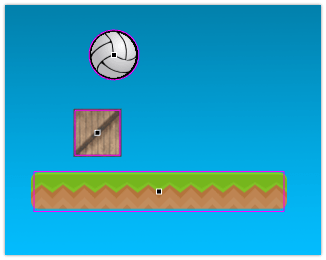

# Colisiones

Las colisiones permiten ejecutar funciones como respuesta al contacto entre diferentes actores. Las funciones se pueden personalizar para hacer casi cualquier cosa: reproducir un sonido para magnificar el impacto, eliminar alguno de los actores en contacto, emitir efectos etc…

Por ejemplo, imaginá que tenemos estos tres actores:



Cuando el juego se ejecute, la plataforma va a quedar fija en pantalla. Mientras que la pelota y la caja van a moverse hacia abajo y colisionarán.

Pilas va a llamar automáticamente a la función `cuando_comienza_una_colision` ni bien entren en contacto dos actores. Por ejemplo en este caso, pilas va a llamar a la función `cuando_comienza_una_colision` cuando la pelota colisione con la caja, y luego la plataforma.

```javascript
class pelota extends Actor {
  propiedades = {
    imagen: "pelota",
    figura: "circulo",
    figura_radio: 25
  };

  cuando_comienza_una_colision(actor) {
    if (actor.etiqueta === "caja") {
      return true;
    }

    if (actor.etiqueta === "plataforma") {
      this.decir("Oh, colisioné con una plataforma!");
    }
  }
}
```

En el código hay dos cosas interesantes, tenemos la función `cuando_comienza_una_colision` dentro de la clase "pelota" para detectar colisiones y además intentamos distinguir contra qué actores se produce la colisión usando [etiquetas](etiquetas.md). :

- Si la pelota colisiona con una caja, le indicamos a pilas que ignore la colisión, y continúe. Esto se hace simplemente retornando `true`.
- Si la pelota colisiona con una plataforma, emitimos un mensaje para que el usuario pueda reconocer que la pelota detectó la colisión.

## Tipos de colisiones

Hay 3 instantes muy importantes cuando se producen colisiones:

- Cuando se detecta el contacto inicial.
- Cuando los dos actores permanecen en contacto prolongado. Por ejemplo cuando un actor se posa sobre una plataforma.
- El instante en donde la colisión desaparece porque los actores dejan de estar en contacto. Por ejemplo cuando un actor posando sobre una plataforma "salta" y deja de estar en contacto.

Para distinguir estos casos pilas llamará a las tres funciones de forma diferente. Este es un ejemplo de cómo se declaran esas funciones en el código de un actor:

```javascript
class mi_actor extends Actor {
  cuando_comienza_una_colision(actor: Actor) {
    if (actor.etiqueta === "moneda") {
      this.pilas.reproducir_sonido("moneda");
      actor.eliminar();
    }
  }

  cuando_se_mantiene_una_colision(actor: Actor) {}

  cuando_termina_una_colision(actor: Actor) {}
}
```

Luego, el tipo de colisión más común que se llamará siempre tiene la siguiente
forma:

```
  cuando_colisiona(actor: Actor) {

  }
```

## Colisiones entre figuras estáticas (no dinámicas)

Hay otro tipo de colisión especial que solo se produce entre figuras
no dinámicas, esas colisiones se notifican constantemente en cada cuadro
de animación mediante el método `cuando_colisionan`.
