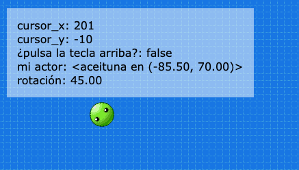
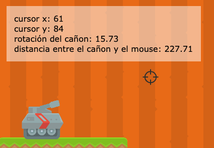

# Observables

Los observables te permiten visualizar rápidamente en pantalla qué valor tienen los atributos, variables o expresiones dentro de un juego.

Por ejemplo, imagina que tu juego tiene un personaje que interactúa con la posición `x` e `y` del cursor del mouse. Mediante observables vas a poder agregar un visor de variables como este:



Es super importante poder visualizar rápidamente variables en un juego, no solo para informarse sino también para detectar errores o incluso saber si estamos accediendo a la información correcta.

Los observables se pueden crear mediante una llamada a la función `pilas.observable` enviando un nombre (a elección tuya) y una variable para observar, por ejemplo:

```typescript
actualizar() {
  this.pilas.observar("cursor_x", this.pilas.cursor_x);
  this.pilas.observar("cursor_y", this.pilas.cursor_y);
  this.pilas.observar("¿pulsa la tecla arriba?", this.pilas.control.arriba);
}
```

Ten en cuenta que los observables se tienen que crear siempre desde funciones `actualizar`, ya sea de actores o de la escena, porque esa es la única forma de que pilas pueda saber el valor más reciente de esas variables.

Otro ejemplo útil, sería poder saber la posición exacta de un actor que hemos creado. Incluso podemos imprimir otros atributos menos visibles como la rotación o la velocidad vertical:

```typescript
class un_actor extends Actor {
  iniciar() {
    this.x = -100;
    this.y = 70;
  }

  actualizar() {
    this.pilas.observar("mi actor", this)
    this.pilas.observar("rotación", this.rotacion)
  }
}
```

Si buscas un ejemplo aplicado de observables abrí el ejemplo angulos:

