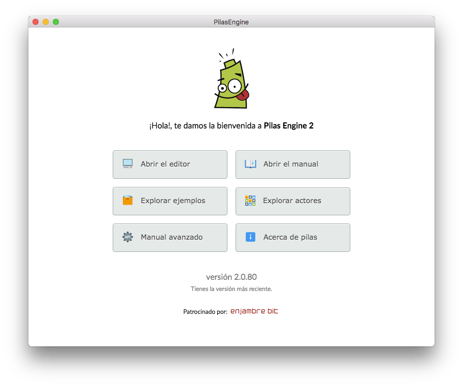
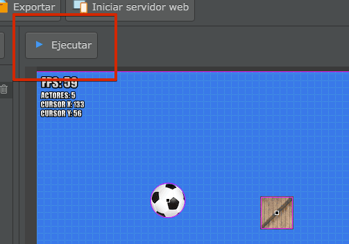
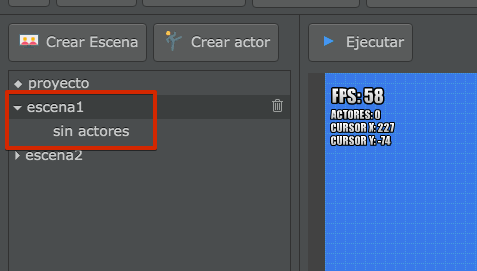

# Primeros pasos

Pilas es un herramienta diseñada para aprender a programar realizando videojuegos, así que creemos que la mejor forma de comenzar es haciendo un pequeño juego. ¡Veamos cómo hacerlo!

Cuando se abre Pilas por primera vez, aparece esta pantalla que llamamos asistente:

Desde aquí se pueden acceder a todas las secciones de pilas, te recomendamos inpeccionarlas al menos una vez para familiarizarte con el entorno.

Sin embargo, para comenzar a dar los primeros pasos con este tutorial vamos a ir directo por la opción principal: "**Abrir el editor**"

Desde esta sección, vas a ver una escena principal y varios paneles:

A principio puede parecer un poco abrumador… pero vamos a ir paso a paso:

La imagen anterior está enumerada para describir los panales principales:

1. El panel de la izquierda es el panel de escenas y actores, desde ahí vas a poder crear escenas, agregar actores a la escena o incluso eliminar cualquiera de las dos cosas. Desde esta sección también se pueden editar las propiedades de cualquier cosas que selecciones (vamos a ver esto más adelante).

2. Justo arriba del area de juego, aparece un botón con la leyenda "Ejecutar", si pulsas ese botón vas a ver el juego en funcionamiento. Desde aquí también se va a poder cancelar la ejecución y otras cosas más (las vamos a ver a continuación).

3. A la derecha de la pantalla aparece el editor de código de pilas, desde donde se puede describir exácamente qué queremos que haga cada actor o escena.

4. Por último, arriba a la derecha aparecen dos interruptores, estos interruptores permiten ocultar los paneles para ganar un poco de espacio mientras estás usando la herramienta. Asegurate de tener todos los paneles visibles mientras realices estos primeros pasos.

## ¡Pongamos en ejecución el juego!

El botón "ejecutar" que aparece arriba en el editor es uno de los más utilizados, ya que nos permite poner en funcionamiento el juego completo. Imaginá que mientras que estamos desarrollando un juego vamos a necesitar ejecutar y probar el juego muchas veces.

Así que hagamos la prueba, pulsá el botón ejecutar una vez. Deberías ver que los objetos en pantalla comienzan a caer y rebotar por la pantalla:

Cuando pulsas el botón "ejecutar" además de ponerse en funcionamiento el juego sucede algo más: el editor por completo ingresará en un modo llamado "ejecución", así que no vamos a poder editar el código o cambiar la escena. Todo lo que suceda en ese momento es parte de la experiencia de usuario de nuestros juegos. Una vez que exportemos el juego, nuestros usuarios solo van a ver el juego, no el editor.

Esto es importante porque nos lleva a ponernos en un rol de diseñador de juegos, y ponernos en el lugar del jugador por un momento. ¿Qué puede hacer quién juega a este juego?, nada muy interesante aún… solo ver cómo rebotan esos dos objetos en la plataforma :|

Para nuestro primer juego vamos a pensar en algo más interesante, queremos que el fondo del juego sea un cielo lleno de estrellas, que el usuario sepa que pueda mover la nave con el teclado; y que luego de unos segundos comiencen a aparecer algunos enemigos.

Pulsá el botón que dice "detener" en el editor (o pulsá la tecla Escape), tendrías que volver a ver el resto de los elementos del editor nuevamente habilitados.

Borremos cada uno de los actores que aparecen en la pantalla, selección al actor pelota y luego pulsa el botón del cesto de basura que aparece a la izquierda:

Repetí esos pasos hasta que la escena quede limpia, sin ningún actor:

Ahora bien, con la escena completamente limpia, agreguemos un actor para representar a nuestro protagonista. Pulsa el botón "Crear actor" y luego selecciona la nave:

Pilas viene con varios actores diseñados para que puedas comenzar a realizar tus juegos rápidamente, sin embargo, esto no es una limitación, porque cada actor que ves en pantalla se puede cambiar complemente.

Ahora sí pulsas el botón "Ejecutar", vas a ver que la nave aparece en el centro de la pantalla. Proba pulsar las teclas de dirección del teclado y espacio para controlar a la nave:

Vas a notar que aparece un rectángulo negro borde blanco en cada actor, ese punto es lo que se conoce como punto de control, y sirve para el punto de referencia de cada actor.

Podes hacer que ese punto de control no se vea pulsando el interruptor "pos" que aparece abajo en la pantalla (pulsa "Detener" antes, así te deja cambiarlo):

