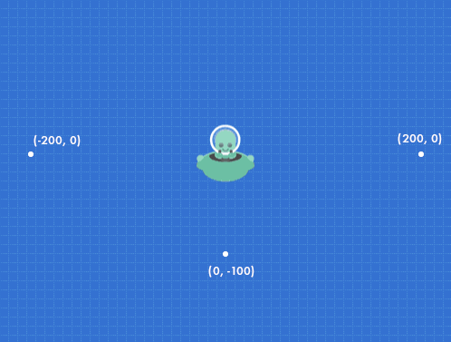
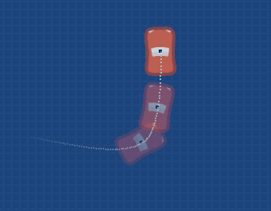
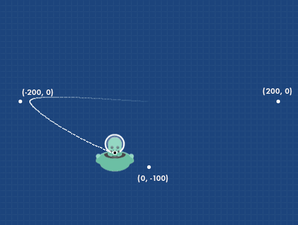
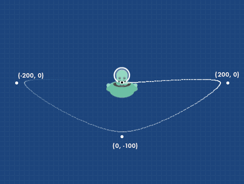

# Recorridos

Los recorridos nos permite realizar movimientos de actores
de manera muy simple, lo que tenemos que hacer es enumerar
todos los puntos "x" e "y" que queremos recorrer y llamar
a una sola función.

## Usando la función hacer_recorrido

Por ejemplo, imagina que tenemos un enemigo de juego de naves, un
ovni con un alien, y queremos que se mueva por la pantalla de
izquierda a derecha.

Primero tenemos que tener en cuenta qué puntos de la pantalla
queremos que recorra. Por ejemplo, que primero visite la posición
`(x= -200, y=0)`, luego hacia abajo a la posición `(x=0, y=-100)`,
luego a la derecha `(x=200, y=0)` y por último que regrese al punto
de origen `(x=0, y=0)`:



Y por último, tenemos que llamar a la función `hacer_recorrido` de
esta forma dentro de una actor:

```typescript
this.hacer_recorrido([-200, 0, 0, -100, 200, 0, 0, 0], 7, 1, false);
```

El primer parámetro tiene que ser una lista con todas las coordenadas
que queremos que recorra. Tenemos que ingresar el número de la coordenada
`x`, luego en de la coordenada `y` y seguir así. Esta lista tiene que tener
la forma `[x_punto_1, y_punto_1, x_punto_2, y_punto_2 ....]`

El segundo argumento, que en este ejemplo es `7`, tiene que ser un número
indicando cuantos segundos tiene que durar el movimiento. En este caso
se pide que el movimiento dure 7 segundos.

El ante último argumento es el número que indicará las repeticiones de esta
animación, si le pasamos `0` el movimiento se va a repetir constantemente.

Y el último argumento indica si el actor deber rotar en dirección al camino
o no. Es útil poner este argumento en `true` cuando el actor es una nave vista
desde arriba o un automóvil:



Ten en cuenta que el actor va a visitar todos los puntos pero de manera
gradual, siguiendo el recorrido pero realizando una curva de movimiento
muy suave:




