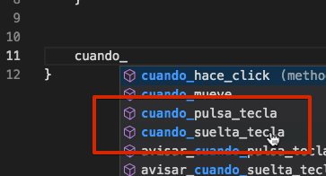

El teclado se puede utilizar de dos formas básicas: por consulta para mover
personajes o mediante eventos para responder a pulsaciones de teclas específicas:

## Primer forma: ¿Cómo mover un personaje con el teclado?

En la mayoría de los juegos para computadoras se puede controlar al
protagonista del juego usando el teclado.

Pilas hace bastante sencillo esto mediante un objeto llamado "control" que
nos va a permitir acceder a las teclas básicas para controlar personajes.

Por ejemplo, para mover un actor hacia izquierda y derecha usando las
flechitas del teclado podemos editar el método "actualizar" del actor
y colocar estas lineas de código:

```typescript

actualizar() {
  if (this.control.izquierda) {
    this.x -= 5;
  }

  if (this.control.derecha) {
    this.x += 5;
  }
}
```

El objeto "control" tiene varios atributos que podemos consultar (mediante
la palabra "if") para saber si en ese instante la tecla está pulsada o
no.

Estas son otros atributos que tiene el objeto "control":

| Tecla            | Código para consultar la tecla | nombre      |
| ---------------- | ------------------------------ | ----------- |
| Flecha izquierda | this.control.izquierda         | "izquierda" |
| Flecha derecha   | this.control.derecha           | "derecha"   |
| Flecha arriba    | this.control.arriba            | "arriba"    |
| Flecha abajo     | this.control.abajo             | "abajo"     |
| Tecla Space      | this.control.espacio           | "espacio"   |
| Alt              | this.control.alt               | "alt"       |
| Control          | this.control.control           | "control"   |
| Shift            | this.control.shift             | "shift"     |
| Tab              | this.control.tab               | "tab"       |
| Backspace        | this.control.backspace         | "backspace" |
| Meta             | this.control.meta              | "meta"      |
| Escape           | this.control.escape            | "escape"    |
| Enter            | this.control.enter             | "enter"     |
| Tecla a          | this.control.tecla_a           | "a"         |
| Tecla b          | this.control.tecla_b           | "b"         |
| Tecla c          | this.control.tecla_c           | "c"         |
| Tecla d          | this.control.tecla_d           | "d"         |
| Tecla e          | this.control.tecla_e           | "e"         |
| Tecla f          | this.control.tecla_f           | "f"         |
| Tecla g          | this.control.tecla_g           | "g"         |
| Tecla h          | this.control.tecla_h           | "h"         |
| Tecla i          | this.control.tecla_i           | "i"         |
| Tecla j          | this.control.tecla_j           | "j"         |
| Tecla k          | this.control.tecla_k           | "k"         |
| Tecla l          | this.control.tecla_l           | "l"         |
| Tecla m          | this.control.tecla_m           | "m"         |
| Tecla n          | this.control.tecla_n           | "n"         |
| Tecla ñ          | this.control.tecla_ñ           | "ñ"         |
| Tecla o          | this.control.tecla_o           | "o"         |
| Tecla p          | this.control.tecla_p           | "p"         |
| Tecla q          | this.control.tecla_q           | "q"         |
| Tecla r          | this.control.tecla_r           | "r"         |
| Tecla s          | this.control.tecla_s           | "s"         |
| Tecla t          | this.control.tecla_t           | "t"         |
| Tecla u          | this.control.tecla_u           | "u"         |
| Tecla v          | this.control.tecla_v           | "v"         |
| Tecla w          | this.control.tecla_w           | "w"         |
| Tecla x          | this.control.tecla_x           | "x"         |
| Tecla y          | this.control.tecla_y           | "y"         |
| Tecla z          | this.control.tecla_z           | "z"         |
| Tecla 1          | this.control.tecla_1           | "1"         |
| Tecla 2          | this.control.tecla_2           | "2"         |
| Tecla 3          | this.control.tecla_3           | "3"         |
| Tecla 4          | this.control.tecla_4           | "4"         |
| Tecla 5          | this.control.tecla_5           | "5"         |
| Tecla 6          | this.control.tecla_6           | "6"         |
| Tecla 7          | this.control.tecla_7           | "7"         |
| Tecla 8          | this.control.tecla_8           | "8"         |
| Tecla 9          | this.control.tecla_9           | "9"         |

## Segunda forma: ¿Cómo reaccionar a eventos del teclado?

Otra forma de acceder al teclado es mediante eventos, para ejecutar
una función justo cuando se pulsa una tecla o se suelta.

Esto es útil por ejemplo en los juegos por turnos o cuando queremos que
el teclado funcione sin repetición, imaginá que si hacemos un juego donde
el jugador pueda disparar, queremos que pulse y suelte la tecla de disparo
muchas veces, no que la deje pulsada y eso dispare automáticamente.

Para capturar eventos de teclado de esta forma tendrías que definir
los métodos `cuando_pulsa_tecla` y `cuando_suelta_tecla` así:

```javascript

  cuando_pulsa_tecla(tecla) {
    if (tecla == "espacio") {
      this.disparar();
    }
  }

  cuando_suelta_tecla(tecla) {
    if (tecla == "1") {
      this.decir("Has soltado la tecla 1")
    }
  }

```

Estos métodos están disponibles tanto en las escenas como en los
actores. Puedes comprobarlo escribiendo "cuando" en el editor y viendo cómo se sugieren las opciones:


